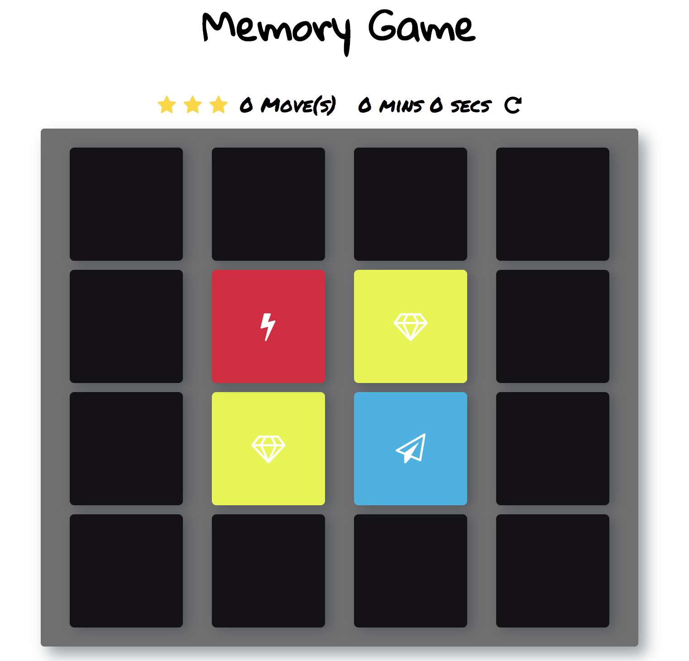

# CIS166A Final Project - Memory Game Project
by [NAME]

## What is the Memory Game
This is a simple game built to test a users memory. There's a deck of cards with different icons.

## Challenge
Match cards in less time with less moves.

## How to Play
[FILL IN DETAILS]

## How I built the Memory Game
[FILL IN DETAILS]
